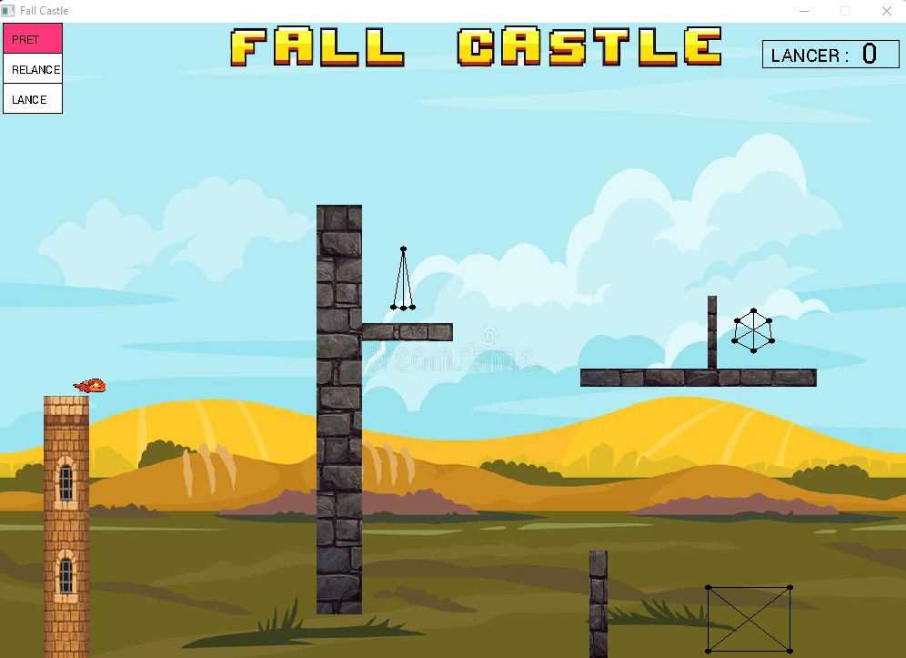
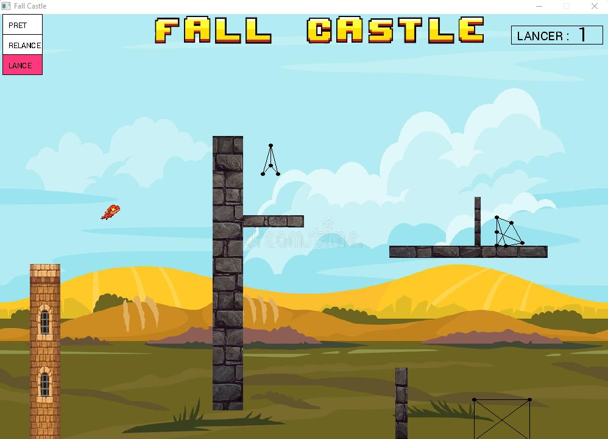
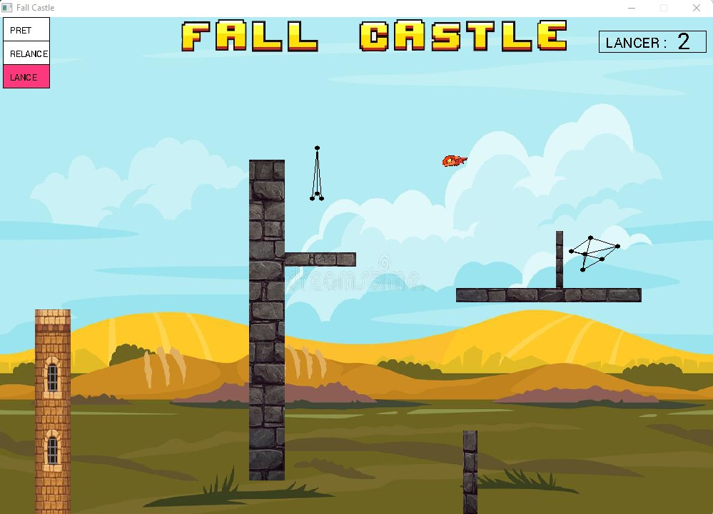
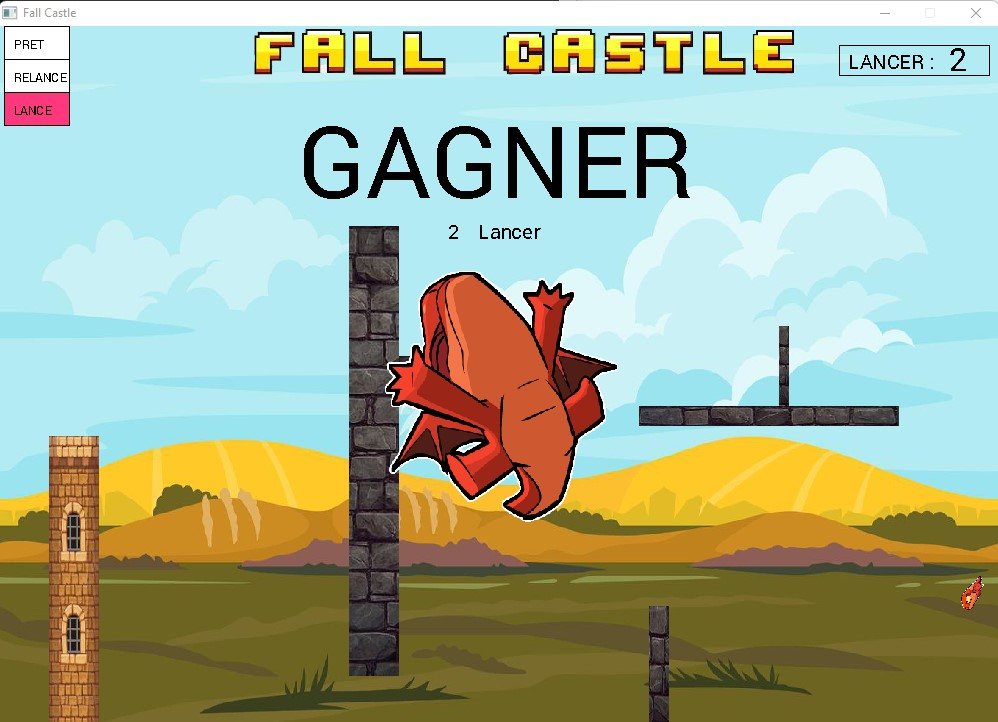

# Fall Castle

## Idea

I wanted to synthesize my learning of the GraPic library with my other particle, image, spring, menu mini-projects in a single project.

Here is Fall Castle, a derivative of Angry Bird where you throw a dragon at knights who move while bouncing.



To shoot in the desired direction, simply click on the screen with the mouse, which will give the direction and speed to the dragon.
And to withdraw, you must click on the corresponding button at the top left.




To win you have to hit all 3 enemies and have the best record !!!



# Starting

- Clone this repo
```bash
$ git clone https://github.com/axelvag/Game_Fall_Castle
```

- Install CodeBlocks (information at the bottom of this page)

# GrAPiC 

## Starting

Linux, Windows and Mac instruction :

http://licence-info.univ-lyon1.fr/grapic

## Introduction

GrAPiC is a small, easy-to-use framework to add graphical functionalities to your C/C++ code. 
Its main goal is to provide easy graphical functions to be used in introduction courses of algorithm and programming in C/C++. 
It is based on SDL2 but to use it you need to know only few very simples functions. 
The Grapic archive comes with the needed SDL part, you do not have to install SDL. Just unzip and enjoy ! 

## Starting

Compiling from the github (which is not the standard way).

* On Linux you need to install:
- g++
- doxygen
- zip
- lib-sdl2-dev lib-sdl2 sd2_image... sdl2_ttf...

1. sudo apt install g++ premake4 zip doxygen libsdl2-dev libsdl2-mixer-dev libsdl2-image-dev
2. make premake
3. make
(4. script/make_linux_test.sh): to test the archive doc/download/grapic-linux.tgz
(5. script/make_web.sh): to create the zip files in doc/download or to sync everything to the webpage (need passwd).


* On windows
0. Install CB 20
1. run premake-cb20.bat to generate the projects files    or     run premake-lifami.bat to generate lifami projects 
2. open build/windows-cb20/grapic.workspace

## Best way to make a projet in windows

(windows): 
 - Open build/windows-cb20/grapic.workspace in CodeBlocks
 - In the left part (Management) of the logiciel, double clic in the projet of yours choice (it's those in /apps)
 - Finally clic in the green arrow in the top of the screen


## Put your new project in GraPic

Add your directory with your cpp files in "apps" and add the path in "premake4".

